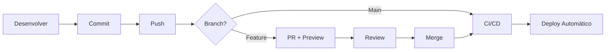

# ✅ Configuração de CI/CD - Resumo

Este documento resume toda a infraestrutura de CI/CD criada para o projeto Wazzy.

## 📦 O Que Foi Criado

### 🔄 GitHub Actions Workflows

```
.github/workflows/
├── ci.yml           ✅ Integração Contínua
├── cd.yml           ✅ Deploy Contínuo
├── preview.yml      ✅ Preview de PRs
├── release.yml      ✅ Gestão de Releases
├── security.yml     ✅ Varredura de Segurança
└── README.md        📄 Documentação dos workflows
```

### 🛠️ Scripts de Deploy

```
scripts/deploy/
├── deploy.sh          🚀 Script principal de deploy
├── backup.sh          💾 Backup automático
├── rollback.sh        ↩️  Rollback de versão
└── check-services.sh  🏥 Health check dos serviços
```

### 📝 Documentação

```
├── CI-CD-GUIDE.md         📖 Guia completo de CI/CD
├── DEPLOYMENT.md          🚀 Guia de deployment
├── CI-CD-SETUP.md         📋 Este arquivo (resumo)
└── env.example            🔧 Exemplo de variáveis de ambiente
```

### 🐳 Docker

```
├── docker-compose.prod.yml  🐋 Compose para produção
├── .dockerignore            🚫 Arquivos ignorados no build
└── src/app/api/health/      ✅ Endpoint de health check
```

### 🔧 Configurações

```
├── .github/dependabot.yml   🤖 Atualizações automáticas
└── .dockerignore            📦 Otimização de builds
```

## 🚀 Como Usar - Guia Rápido

### 1️⃣ Primeira Configuração (5 minutos)

```bash
# 1. Configure os secrets no GitHub
# Acesse: Settings > Secrets and variables > Actions

# Secrets obrigatórios:
DEPLOY_HOST=seu-servidor.com
DEPLOY_USER=ubuntu
DEPLOY_SSH_KEY=<sua-chave-privada-ssh>
DEPLOY_PATH=/home/ubuntu/wazzy
```

### 2️⃣ Primeiro Deploy Manual (10 minutos)

```bash
# No seu servidor de produção:
ssh user@servidor

# Clone o repositório
git clone <seu-repositorio> wazzy
cd wazzy

# Configure variáveis de ambiente
cp env.example .env
nano .env  # Edite com suas credenciais

# Suba os serviços
docker compose up -d

# Execute migrations
docker compose exec app npx prisma migrate deploy

# Verifique status
docker compose ps
```

### 3️⃣ Deploy Automático (Instantâneo!)

Após a configuração inicial, todo deploy é automático:

```bash
# Faça suas alterações
git add .
git commit -m "feat: nova funcionalidade"
git push origin main

# CI/CD automaticamente:
# ✅ Roda testes
# ✅ Faz build
# ✅ Cria imagem Docker
# ✅ Faz deploy em produção
# ✅ Verifica saúde dos serviços
```

### 4️⃣ Criar Release (Opcional)

```bash
# Criar versão
git tag -a v1.0.0 -m "Release v1.0.0"
git push origin v1.0.0

# GitHub Actions automaticamente:
# ✅ Cria release no GitHub
# ✅ Gera changelog
# ✅ Publica imagens Docker com versão
# ✅ Faz deploy
```

## 🔍 Fluxo de Trabalho

### Para Desenvolvedores



### Pipeline de CI (Pull Request)

```
PR Criado/Atualizado
    ↓
1. Lint & Type Check (1-2 min)
    ↓
2. Testes Unitários (2-3 min)
    ↓
3. Testes de Integração (3-5 min)
    ↓
4. Build da Aplicação (3-5 min)
    ↓
5. Preview Build (2-3 min)
    ↓
✅ PR Pronto para Review
```

### Pipeline de CD (Push para Main)

```
Push para Main
    ↓
1. Executar CI (8-12 min)
    ↓
2. Build Docker Images (5-8 min)
    ↓
3. Push para Registry (2-3 min)
    ↓
4. Backup no Servidor (1-2 min)
    ↓
5. Deploy (Zero Downtime) (2-3 min)
    ↓
6. Health Check (30 seg)
    ↓
✅ Deploy Concluído
```

## 📊 Workflows em Detalhes

### CI Workflow (`ci.yml`)

**Quando:** Pull Requests e pushes para `main`/`develop`

**O que faz:**

- ✅ ESLint + Type Check
- ✅ Testes unitários com coverage
- ✅ Testes de integração com PostgreSQL + Redis
- ✅ Build da aplicação Next.js
- ✅ Upload de artifacts

**Tempo:** ~8-12 minutos

### CD Workflow (`cd.yml`)

**Quando:** Push para `main` ou tags `v*`

**O que faz:**

- 🐳 Build de imagens Docker (app + worker)
- 📦 Push para GitHub Container Registry
- 🔄 Deploy via SSH no servidor
- 🗄️ Executa migrations do Prisma
- 🔄 Restart dos serviços (zero downtime)
- 🧹 Limpeza de imagens antigas
- 📢 Notificações (opcional)

**Tempo:** ~10-15 minutos

### Preview Workflow (`preview.yml`)

**Quando:** Pull Requests

**O que faz:**

- 🐳 Build de imagem preview
- 💬 Comenta na PR com instruções
- 🔗 Link para testar (se configurado)

**Tempo:** ~5-8 minutos

### Security Workflow (`security.yml`)

**Quando:** Push, PR e toda segunda 9h UTC

**O que faz:**

- 🔍 npm audit + Snyk
- 🐳 Trivy scan (Docker)
- 💻 CodeQL analysis
- 📊 Upload para GitHub Security

**Tempo:** ~5-10 minutos

### Release Workflow (`release.yml`)

**Quando:** Tags `v*`

**O que faz:**

- 📝 Gera changelog automático
- 🏷️ Cria GitHub Release
- 📦 Documenta versões Docker
- 🔗 Links para imagens

**Tempo:** ~2-3 minutos

## 🔐 Secrets Necessários

### Obrigatórios (Para Deploy)

| Secret           | Descrição              | Exemplo              |
| ---------------- | ---------------------- | -------------------- |
| `DEPLOY_HOST`    | IP/domínio do servidor | `123.45.67.89`       |
| `DEPLOY_USER`    | Usuário SSH            | `ubuntu`             |
| `DEPLOY_SSH_KEY` | Chave SSH privada      | `-----BEGIN RSA...`  |
| `DEPLOY_PATH`    | Caminho no servidor    | `/home/ubuntu/wazzy` |

### Opcionais (Para Recursos Avançados)

| Secret                | Descrição       | Como Obter                 |
| --------------------- | --------------- | -------------------------- |
| `SNYK_TOKEN`          | Token Snyk      | [snyk.io](https://snyk.io) |
| `SLACK_WEBHOOK_URL`   | Webhook Slack   | Settings do canal          |
| `DISCORD_WEBHOOK_URL` | Webhook Discord | Server Settings            |

## 🎯 Features Implementadas

### ✅ Integração Contínua

- [x] Lint automático
- [x] Type checking
- [x] Testes unitários
- [x] Testes de integração
- [x] Build validation
- [x] Coverage reports

### ✅ Deploy Contínuo

- [x] Build automático de Docker
- [x] Push para registry
- [x] Deploy via SSH
- [x] Zero downtime deployment
- [x] Rollback automático em falhas
- [x] Health checks

### ✅ Segurança

- [x] Varredura de dependências
- [x] Scan de imagens Docker
- [x] Análise de código (CodeQL)
- [x] Dependabot configurado
- [x] Scans semanais agendados

### ✅ DevOps

- [x] Preview de PRs
- [x] Versionamento semântico
- [x] Changelog automático
- [x] Backup antes de deploy
- [x] Scripts de rollback
- [x] Health check endpoint

## 📚 Documentação Completa

Consulte estes arquivos para mais detalhes:

| Arquivo                                                        | Conteúdo                             |
| -------------------------------------------------------------- | ------------------------------------ |
| [`CI-CD-GUIDE.md`](./CI-CD-GUIDE.md)                           | Guia completo de configuração e uso  |
| [`DEPLOYMENT.md`](./DEPLOYMENT.md)                             | Guia de deployment e troubleshooting |
| [`.github/workflows/README.md`](./.github/workflows/README.md) | Detalhes dos workflows               |

## 🔧 Customizações

### Alterar Estratégia de Deploy

Edite `.github/workflows/cd.yml`:

```yaml
# Opção 1: SSH (padrão)
- name: Deploy via SSH
  uses: appleboy/ssh-action@v1.0.3

# Opção 2: Kubernetes
- name: Deploy to Kubernetes
  run: kubectl set image...

# Opção 3: Cloud Provider
- name: Deploy to AWS/GCP/Azure
  uses: ...
```

### Adicionar Notificações

```yaml
# Slack
- name: Slack Notification
  uses: 8398a7/action-slack@v3
  with:
    status: ${{ job.status }}
    webhook_url: ${{ secrets.SLACK_WEBHOOK_URL }}

# Discord
- name: Discord Notification
  uses: sarisia/actions-status-discord@v1
  with:
    webhook: ${{ secrets.DISCORD_WEBHOOK_URL }}
```

### Configurar Ambientes Múltiplos

Crie workflows adicionais para staging:

```yaml
# .github/workflows/cd-staging.yml
on:
  push:
    branches: [develop]

# Use secrets específicos
env:
  DEPLOY_HOST: ${{ secrets.STAGING_HOST }}
```

## 🚨 Troubleshooting

### CI Falhando

```bash
# Teste localmente
npm run lint
npm run test:jsdom
npm run build
```

### Deploy Falhando

```bash
# Verifique conexão SSH
ssh -i ~/.ssh/key user@host

# Verifique logs no servidor
ssh user@host "cd /path && docker compose logs"
```

### Testes Falhando

```bash
# Rode testes localmente com mesmos serviços
npm run test:db:up
npm run test:integration
npm run test:db:down
```

## 📈 Próximos Passos

Após configurar o CI/CD básico, considere:

- [ ] Configurar monitoramento (Sentry, DataDog)
- [ ] Adicionar testes E2E (Playwright, Cypress)
- [ ] Configurar staging environment
- [ ] Implementar feature flags
- [ ] Adicionar performance monitoring
- [ ] Configurar backups automáticos
- [ ] Implementar blue-green deployment

## 🤝 Contribuindo

Para fazer alterações nos workflows:

1. Teste localmente com [act](https://github.com/nektos/act)
2. Documente mudanças
3. Atualize este README
4. Notifique o time sobre novos secrets

## 💡 Dicas

### Desenvolvimento

- Use `npm run dev` para desenvolvimento local
- Crie branches feature para novas funcionalidades
- Abra PRs para revisão de código

### Deploy

- Sempre teste em staging primeiro
- Faça deploy em horários de baixo tráfego
- Monitore logs após deploy
- Tenha plano de rollback pronto

### Segurança

- Nunca comite secrets
- Rotacione credenciais regularmente
- Use variáveis de ambiente
- Mantenha dependências atualizadas

## 📞 Suporte

- **Documentação:** Veja os guias completos neste repositório
- **Issues:** Abra uma issue com label `ci/cd`
- **CI/CD Status:** Verifique a aba Actions no GitHub
- **Logs:** `docker compose logs` no servidor

---

## 🎉 Pronto para Usar!

Sua infraestrutura de CI/CD está completamente configurada!

**Próximos Passos:**

1. Configure os secrets no GitHub
2. Faça um push para `main`
3. Acompanhe o deploy na aba Actions
4. Verifique a aplicação rodando

**Precisa de ajuda?** Consulte [`CI-CD-GUIDE.md`](./CI-CD-GUIDE.md) para instruções detalhadas.

---

_Documentação criada em: ${new Date().toLocaleDateString('pt-BR')}_
