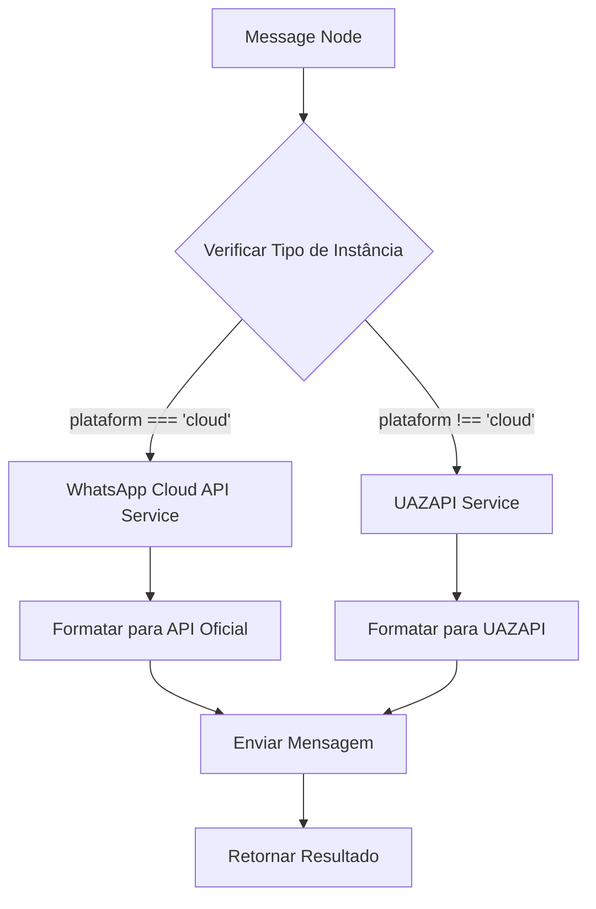

# Integração WhatsApp Cloud API (Oficial)

## 📋 Resumo

Foi implementado suporte completo para envio de mensagens via WhatsApp Cloud API (oficial da Meta) no sistema de chatbot flows. O sistema agora detecta automaticamente o tipo de instância e roteia para o endpoint apropriado:

- **UAZAPI**: Para instâncias tradicionais (plataform != 'cloud')
- **WhatsApp Cloud API**: Para instâncias oficiais (plataform === 'cloud')

## ✅ Funcionalidades Implementadas

### 1. Mensagens de Texto

- Envio de mensagens de texto simples
- Suporte a preview de URL (`preview_url`)
- Substituição de variáveis dinâmicas
- Formatação automática de números de telefone

### 2. Mensagens de Mídia

- **Imagens**: Suporte a envio de imagens com caption
- **Vídeos**: Suporte a envio de vídeos com caption
- **Documentos**: Suporte a envio de documentos com filename e caption
- **Áudios**: Suporte a áudios (incluindo conversão de 'myaudio' e 'ptt' para 'audio')

### 3. Mensagens de Localização

- Envio de coordenadas (latitude e longitude)
- Campos opcionais: nome e endereço

### 4. Mensagens de Contato

- Envio de contatos formatados no padrão vCard
- Suporte a múltiplos telefones
- Campos opcionais: email, organização, URL

### 5. Menus Interativos

#### Botões (Button)

- Até 3 botões por mensagem (limitação da API oficial)
- Cada botão com ID e título (max 20 caracteres)
- Suporte a footer

#### Listas (List)

- Múltiplas seções com títulos
- Até 10 itens por seção
- Cada item com ID, título (max 24 chars) e descrição (max 72 chars)
- Suporte a footer e botão customizado

### 6. Limitações e Diferenças

#### Não suportados pela API Oficial:

- **Poll**: Enquetes não são suportadas (use button ou list)
- **Carousel**: Carrosséis ainda não são suportados (use button ou list)
- **Link Preview Customizado**: A API oficial não suporta customização completa de preview
- **Botões de Ação (copy, call, link)**: A API oficial usa apenas reply buttons

## 🏗️ Arquitetura

### Arquivos Criados/Modificados

1. **`src/services/whatsapp-cloud/whatsapp-cloud.service.ts`** (NOVO)

   - Serviço dedicado para comunicação com WhatsApp Cloud API
   - Funções:
     - `sendTextMessage()`
     - `sendMediaMessage()`
     - `sendLocationMessage()`
     - `sendContactMessage()`
     - `sendInteractiveButtonMessage()`
     - `sendInteractiveListMessage()`

2. **`src/workers/helpers/node-processors/message-helper.ts`** (MODIFICADO)
   - Adicionada função `isWhatsAppCloudInstance()` para detectar tipo de instância
   - Lógica de roteamento baseada no tipo de instância
   - Conversão de formatos entre UAZAPI e WhatsApp Cloud API

### Fluxo de Execução



## 🧪 Como Testar

### Pré-requisitos

1. Ter uma instância WhatsApp Cloud API conectada (via Embedded Signup)
2. A instância deve ter:
   - `plataform: 'cloud'`
   - `whatsapp_official_enabled: true`
   - `whatsapp_official_phone_number_id` configurado
   - `whatsapp_official_access_token` válido

### Teste 1: Mensagem de Texto

1. Criar um flow com:

   - **Webhook Node** (trigger)
   - **Message Node** configurado com:
     - Instância: Selecionar instância Cloud API
     - Tipo: Texto
     - Número: `5511999999999` (ou variável)
     - Mensagem: `Olá! Esta é uma mensagem via WhatsApp Cloud API`

2. Executar o flow via webhook
3. Verificar logs do servidor para confirmar roteamento correto:
   ```
   🔍 Instance type: WhatsApp Cloud API
   🌐 Using WhatsApp Cloud API
   ```

### Teste 2: Mensagem com Mídia

1. Configurar Message Node:

   - Tipo: Mídia
   - Tipo de Mídia: Imagem
   - URL: `https://exemplo.com/imagem.jpg`
   - Caption: `Legenda da imagem`

2. Verificar envio e recebimento da mídia

### Teste 3: Menu com Botões

1. Configurar Message Node:

   - Tipo: Menu Interativo
   - Tipo de Menu: Botões
   - Texto: `Escolha uma opção:`
   - Adicionar até 3 botões:
     - Texto: `Opção 1` | ID: `opt1`
     - Texto: `Opção 2` | ID: `opt2`
     - Texto: `Opção 3` | ID: `opt3`

2. Verificar formato dos botões no WhatsApp

### Teste 4: Menu com Lista

1. Configurar Message Node:

   - Tipo: Menu Interativo
   - Tipo de Menu: Lista
   - Texto: `Escolha uma categoria:`
   - Botão: `Ver Categorias`
   - Adicionar categorias e itens:
     - **Categoria 1**:
       - Item 1: `Produto A` | ID: `prod_a` | Descrição: `Descrição A`
       - Item 2: `Produto B` | ID: `prod_b` | Descrição: `Descrição B`

2. Verificar formato da lista no WhatsApp

## 📊 Logs e Debugging

### Logs Importantes

Quando uma mensagem é enviada via WhatsApp Cloud API, os seguintes logs aparecem:

```
🔍 Instance type: WhatsApp Cloud API
🌐 Using WhatsApp Cloud API
📤 Sending text message via WhatsApp Cloud API: {
  phoneNumberId: '831680426701178',
  to: '5511999999999',
  textLength: 42
}
✅ Message sent successfully via WhatsApp Cloud API
```

### Erros Comuns

1. **Instance is not a WhatsApp Cloud API instance**

   - A instância selecionada não tem `plataform: 'cloud'`
   - Verifique a instância no banco de dados

2. **WhatsApp Cloud API credentials not configured**

   - `whatsapp_official_phone_number_id` ou `whatsapp_official_access_token` não estão configurados
   - Reconecte a instância via Embedded Signup

3. **WhatsApp Cloud API error: ...**
   - Erro retornado pela API da Meta
   - Verificar mensagem de erro específica
   - Conferir se o access_token ainda é válido

## 🔧 Configuração Necessária

### Variáveis de Ambiente

Nenhuma variável de ambiente adicional é necessária. Os dados são obtidos diretamente do banco:

- `whatsapp_official_phone_number_id`
- `whatsapp_official_access_token`

### Banco de Dados

A tabela `instances` já possui os campos necessários (adicionados na migration `20251104200137_add_whatsapp_official_fields`):

```sql
whatsapp_official_enabled          BOOLEAN
whatsapp_official_phone_number_id  VARCHAR(255)
whatsapp_official_access_token     TEXT
whatsapp_official_phone_number     VARCHAR(50)
whatsapp_official_status           VARCHAR(50)
-- etc
```

## 📚 Documentação da API Oficial

- [Mensagens de Texto](https://developers.facebook.com/docs/whatsapp/cloud-api/messages/text-messages)
- [Mensagens de Mídia](https://developers.facebook.com/docs/whatsapp/cloud-api/messages/image-messages)
- [Mensagens Interativas](https://developers.facebook.com/docs/whatsapp/cloud-api/messages/interactive-messages)
- [Mensagens de Contato](https://developers.facebook.com/docs/whatsapp/cloud-api/messages/contact-messages)
- [Mensagens de Localização](https://developers.facebook.com/docs/whatsapp/cloud-api/messages/location-messages)

## 🎯 Próximos Passos

### Funcionalidades Futuras

1. **Suporte a Templates**: Envio de templates aprovados pela Meta
2. **Upload de Mídia**: Upload direto para servidores da Meta antes do envio
3. **Mensagens de Reação**: Adicionar reações às mensagens
4. **Marca d'água de Leitura**: Marcar mensagens como lidas
5. **Carousel (quando disponível)**: Suporte a carrosséis quando a API oficializar

### Melhorias Possíveis

1. Cache do tipo de instância para evitar query repetida
2. Retry automático em caso de erro temporário
3. Validação de tokens expirados com refresh automático
4. Métricas de uso (mensagens enviadas por instância)

## 🚀 Como Usar no Frontend

### No Message Node Config

Quando o usuário seleciona uma instância WhatsApp Cloud API no dropdown, a interface continua a mesma. A única diferença é que:

1. **Limitações são aplicadas automaticamente**:

   - Botões: máximo 3 (trunca automaticamente)
   - Títulos: máximo 20 caracteres (trunca)
   - Descrições: máximo 72 caracteres (trunca)

2. **Tipos não suportados geram erro claro**:

   - Poll: "Poll type is not supported by WhatsApp Cloud API"
   - Carousel: "Carousel type is not yet supported by WhatsApp Cloud API"

3. **Mensagens de erro são mais descritivas**:
   ```
   WhatsApp Cloud API error: Invalid phone number format
   ```

## ✅ Checklist de Implementação

- [x] Criar serviço WhatsApp Cloud API
- [x] Implementar envio de texto
- [x] Implementar envio de mídia
- [x] Implementar envio de localização
- [x] Implementar envio de contato
- [x] Implementar botões interativos
- [x] Implementar listas interativas
- [x] Detectar tipo de instância automaticamente
- [x] Rotear para endpoint correto
- [x] Converter formatos entre APIs
- [x] Tratar erros específicos da API oficial
- [x] Documentar implementação
- [ ] Testar com instância real
- [ ] Validar todos os cenários

---

**Data de Implementação**: 11 de Novembro de 2025  
**Versão da API**: v21.0  
**Status**: ✅ Implementado e pronto para testes
